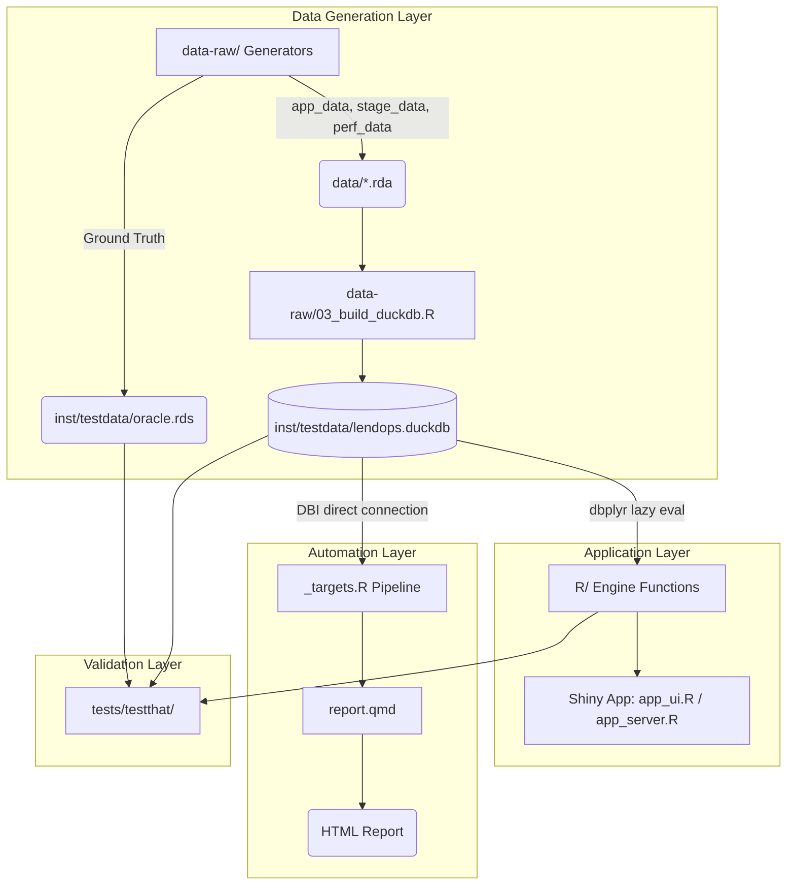

# lendops: Lending Operations Dashboard Suite

lendops is an operational analytics application built to fulfill the data-driven requirements of Credit-SME lending departments. Designed as the operations-side counterpart to credit scoring models, this suite provides end-to-end visibility into the loan origination lifecycle, portfolio health, and key performance indicators. It leverages an in-memory analytical SQL warehouse (DuckDB) and automated reporting pipelines to ensure uninterrupted data availability for senior management.


---

## Architecture & Tech Stack

The project is built as an R package using the golem framework. Data is generated synthetically with pre-registered ground-truth anomalies, stored in a DuckDB database, and accessed via dbplyr for lazy SQL execution. A `{targets}` pipeline orchestrates data extraction and rendering of a parameterized Quarto report.



**Core Technologies:**

- **Data Warehouse:** DuckDB (via DBI and dbplyr)
- **App Framework:** Shiny (via golem), bslib for modern UI components
- **Visualizations:** Plotly, networkD3 (Sankey), ggplot2
- **Reporting:** Quarto, `{targets}`, `{tarchetypes}`
- **Testing:** testthat (including blind anomaly detection)

---

## Repository Layout

```text
lendops/
├── R/                     # Core analytics engine functions (dbplyr SQL queries)
├── data-raw/              # Scripts for generating synthetic data and DuckDB warehouse
│   ├── 01_generate_origination.R
│   ├── 02_generate_performance.R
│   └── 03_build_duckdb.R
├── data/                  # Generated .rda files (applications, stages, performance)
├── inst/
│   ├── sql/               # Explicit DDL schema (CREATE TABLE / indexes / views)
│   └── testdata/          # DuckDB database file and the ground-truth oracle
├── tests/
│   └── testthat/          # Unit tests, including blind anomaly detection suite
├── app_ui.R               # Shiny UI definition (bslib layout, cards, filters)
├── app_server.R           # Shiny server logic (reactives, plotly, networkD3)
├── _targets.R             # Pipeline orchestration for automated reporting
└── report.qmd             # Parameterized Quarto report rendered by {targets}
```

---

## Module Status

| Module | Description |
|--------|-------------|
| 1. Origination Tracker | Event-sourced tracking of application flow. Features a Sankey diagram for stage-to-stage volume movement and grouped bar charts for Turnaround Time (TAT) analysis by branch and sector. Supports dynamic filtering via SQL pushdown. |
| 2. Portfolio Health | Analytics for disbursed loan performance. Includes correctly censored vintage delinquency curves (by months-on-book) and roll-rate migration matrices presented as Markov chain transition estimators. |
| 3. KPI Cockpit | Senior management view featuring value boxes for high-level metrics (Total Applications, Approval Rate, Disbursed Amount in BDT Crore, Average Ticket Size in BDT Lakh) and an Actual vs. Target disbursement trend chart. |
| 4. Reporting Layer | An automated `{targets}` pipeline that extracts fresh data from DuckDB and renders a parameterized Quarto HTML report, ensuring uninterrupted availability of periodic management summaries. |

---

## Data Generation & Validation Rigor

The project utilizes a self-checking synthetic data generation protocol designed to validate analytical accuracy.

- **Ground Truth Oracle:** An oracle file (`inst/testdata/oracle.rds`) stores the exact parameters of injected data anomalies. The Shiny application never reads this file; it is strictly reserved for the test suite.
- **Pre-registered Anomalies:** Three structural breaks were injected into the data:
  - A TAT bottleneck (2x inflation) in the Documentation stage for specific branches.
  - A gradual approval rate policy shift starting from a specific month.
  - An elevated early delinquency spike in a specific origination cohort.
- **Blind Anomaly Detection:** The test suite includes a "blind" test that runs the analytics engine against the data without accessing the oracle. It successfully detects the anomalies purely by calculating statistical thresholds and variances, proving the robustness of the underlying math.

---

## Limitations

- **Synthetic Data:** All application and performance data is synthetically generated. Real-world banking data will contain edge cases in timestamp formatting, sector mappings, and unstructured decline reasons not present here.
- **Sankey Simplification:** The Sankey diagram visualizes the primary linear "happy path" of an application (Received to Disbursement). It does not visualize complex, multi-directional transition paths between terminal states (e.g., an application moving backward from Decision to Credit Assessment).
- **Scope Exclusions:** To maintain a focus on operational data engineering, SQL analytics, and dashboarding, granular regulatory classification logic and behavioral scoring ML models were intentionally scoped out of this iteration.

---

## Application Screenshots


---
## How to Run

**1. Clone the repository.**

**2. Install dependencies:**
Open the project in RStudio and run:

```r
renv::restore()
```

Or manually install the packages listed in `DESCRIPTION`.

**3. Generate Data & Database:**
Run the scripts in `data-raw/` in numerical order to build the DuckDB warehouse:

```r
# Run in order: 01, 02, then 03
source("data-raw/01_...")
source("data-raw/02_...")
source("data-raw/03_build_duckdb.R")
```

**4. Run the Shiny App:**

```r
golem::run_dev()
```

**5. Render the Report:**

```r
targets::tar_make()
```

Generates the automated Quarto HTML report.
